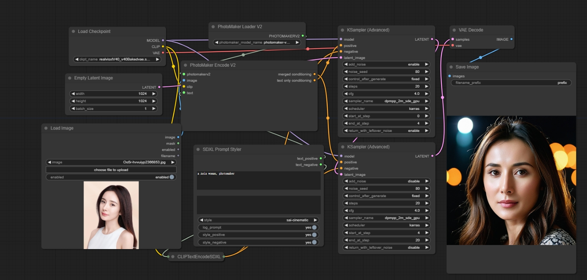

# PhotoMakerV2 Native

[PhotoMaker](https://github.com/TencentARC/PhotoMaker?tab=readme-ov-file) released version v2 a few months ago, but no one had updated it for Comfy v1. This repository provides an adaptation of PhotoMaker v2 for Comfy, as Comfy did not accept the original PR. The code here is very similar to the Comfy v1 version.

Most of the code originates from [PhotoMaker](https://github.com/TencentARC/PhotoMaker?tab=readme-ov-file); it has been adapted for Comfy by modifying the v1 code and adding two new nodes.

## Installation
Clone this repository into `ComfyUI/custom_nodes`:

```bash
git clone https://github.com/zhangp365/ComfyUI_photomakerV2_native.git
```

PhotoMaker v2 requires the InsightFace library, so please ensure all dependencies are installed by running:

```bash
pip install -r requirements.txt
```

As in v1, download and place the [photomaker-v2.bin](https://huggingface.co/TencentARC/PhotoMaker-V2/blob/main/photomaker-v2.bin) file in the `/app/models/photomaker` directory.

When the node runs for the first time, it will automatically download the InsightFace model.

## Base Model
It’s recommended to use the official base model [realvisxlV40_v40Bakedvae](https://huggingface.co/frankjoshua/realvisxlV40_v40Bakedvae/blob/main/realvisxlV40_v40Bakedvae.safetensors).

## Trigger Word
As in the official Comfy v1 version, the trigger word is `photomaker`, not `img`.

# workflow and example
workflow


the image of the workflow.


